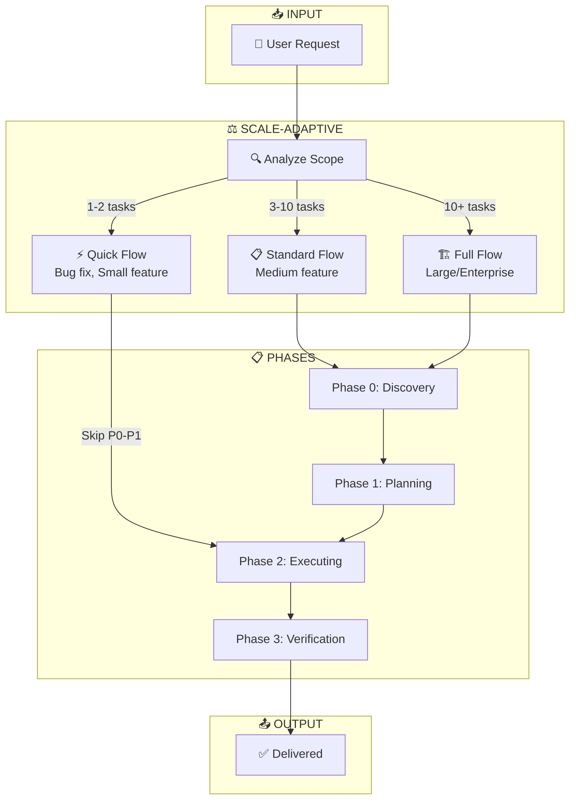
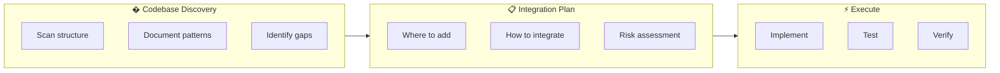

# 🔄 WORKFLOW - Stateful Single-Agent (Enhanced)

> 📅 Version: 5.0 | Updated: 2026-01-10
>
> 🎯 **Philosophy**: AI first → Docs second → Code third → Quality check last

---

## 🌟 CORE CONCEPT



**Stateful Workflow v5.0** - Scale-Adaptive Intelligence:

| Track | Khi nào | Bỏ qua | Thời gian |
|-------|---------|--------|-----------|
| ⚡ **Quick Flow** | Bug fix, hotfix, small tweak | Phase 0, 1 | Phút |
| 📋 **Standard Flow** | Feature mới, module nhỏ-vừa | Không | Giờ |
| 🏗️ **Full Flow** | Dự án lớn, enterprise | Không + thêm docs | Ngày |

```
┌─────────────────────────────────────────────────────────────────┐
│                    STATEFUL WORKFLOW v5.0                        │
├─────────────────────────────────────────────────────────────────┤
│                                                                  │
│   ┌──────────┐   ┌──────────┐   ┌──────────┐   ┌──────────┐    │
│   │ DISCOVERY│──▶│ PLANNING │──▶│ EXECUTING│──▶│  VERIFY  │    │
│   │ Phase 0  │   │ Phase 1  │   │ Phase 2  │   │ Phase 3  │    │
│   └──────────┘   └──────────┘   └──────────┘   └──────────┘    │
│        │              │              │              │            │
│        └──────────────┴──────────────┴──────────────┘            │
│                              │                                   │
│                              ▼                                   │
│        ┌─────────────────────────────────────────┐              │
│        │         📁 PERSISTENT FILES              │              │
│        │                                          │              │
│        │  docs/*.md     ← BA Specifications      │              │
│        │  context.md    ← Current state          │              │
│        │  task-queue.md ← Task list              │              │
│        │  src/*         ← Actual code            │              │
│        └─────────────────────────────────────────┘              │
│                                                                  │
│   ✅ AI first: 7 vai trò chuyên biệt (Core + Supporting)        │
│   ✅ Docs second: Documentation-driven development              │
│   ✅ Code third: Implement theo specs + test cases              │
│   ✅ Quality last: Verify 3 tiêu chí đầu ra                     │
│                                                                  │
└─────────────────────────────────────────────────────────────────┘
```

---

## ⚡ QUICK FLOW (Dành cho Bug Fix / Small Feature)

> **Khi nào dùng**: Bug fix, hotfix, small tweak, 1-2 tasks đơn giản

**3-Step Process**:
```
User: "Fix bug [X]" hoặc "Thêm [small feature]"
         │
         ▼
┌─────────────────────────────────────────────────────────────┐
│ Step 1: SPEC (2-5 phút)                                     │
├─────────────────────────────────────────────────────────────┤
│ AI: Hiểu vấn đề → Xác định files cần sửa → Confirm approach │
│ AI: "Tôi sẽ [approach]. OK không?"                          │
└─────────────────────────────────────────────────────────────┘
         │
         ▼
┌─────────────────────────────────────────────────────────────┐
│ Step 2: DEV (5-30 phút)                                     │
├─────────────────────────────────────────────────────────────┤
│ AI: Implement changes → Run tests → Fix issues              │
│ AI: Update context.md với changes                           │
└─────────────────────────────────────────────────────────────┘
         │
         ▼
┌─────────────────────────────────────────────────────────────┐
│ Step 3: REVIEW (Optional, 2-5 phút)                         │
├─────────────────────────────────────────────────────────────┤
│ AI: "Done! [Summary of changes]. Cần review gì thêm?"       │
│ User: "OK" hoặc "Sửa thêm [Y]"                              │
└─────────────────────────────────────────────────────────────┘
```

**Quick Flow Commands**:
| Command | Action |
|---------|--------|
| "Fix bug [X]" | Bắt đầu Quick Flow cho bug |
| "Quick: [task]" | Bắt đầu Quick Flow cho task nhỏ |
| "Hotfix [X]" | Giống Quick Flow, ưu tiên cao |

---

## 📋 4 PHASES (Standard/Full Flow)

### Phase 0: DISCOVERY & ANALYSIS 🔍

> **Mục đích**: AI đóng 3 vai trò (BA + Tech Lead + Tester Lead) phân tích và tạo đầy đủ tài liệu

**3-Role Discussion Model**:
```
┌────────────────────────────────────────────────────────────────┐
│          AI ĐÓng 3 VAI TRÒ TRAO ĐỔI CHI TIẾT                    │
├────────────────────────────────────────────────────────────────┤
│                                                                 │
│   🎯 BA (Business Analyst)                                      │
│      ├── Phân tích yêu cầu                                      │
│      ├── Tạo PRD (Product Requirements)                        │
│      └── Tạo User Stories với Acceptance Criteria              │
│                                                                 │
│   🛠️ Tech Lead                                                  │
│      ├── Đánh giá tính khả thi kỹ thuật                        │
│      ├── Xác định Data Model + Architecture                    │
│      └── Tạo UI Specs + API Specs                              │
│                                                                 │
│   🧪 Tester Lead                                                │
│      ├── Từ User Stories → Tạo Test Cases                      │
│      ├── Định nghĩa acceptance tests                           │
│      └── Đảm bảo testability của requirements                  │
│                                                                 │
└────────────────────────────────────────────────────────────────┘
```

**Khi nào**: Khi bắt đầu dự án mới hoặc module lớn

**Input**: User mô tả ý tưởng/yêu cầu

**Output** (trong folder `docs/`):

| Document | Vai trò | Nội dung | Bắt buộc? |
|----------|---------|----------|-----------|
| `prd.md` | BA | Problem, Goals, Users, Features | ✅ Yes |
| `user-stories.md` | BA | User Stories với Acceptance Criteria | ✅ Yes |
| `data-model.md` | Tech Lead | ERD, Tables, Columns, Relations | ✅ Yes |
| `ui-specs.md` | Tech Lead | Layout, Components, Responsive | 🟡 If UI |
| `api-specs.md` | Tech Lead | Endpoints, Request/Response | 🟡 If API |
| `test-cases.md` | Tester Lead | Functional, UI, API, Security Tests | ✅ Yes |

**Flow Chi Tiết**:
```
User: "Tôi muốn làm [mô tả dự án]"
         │
         ▼
┌─────────────────────────────────────────────────────────────┐
│ AI: HỎI CLARIFYING QUESTIONS                                │
├─────────────────────────────────────────────────────────────┤
│ - Mục tiêu chính là gì?                                     │
│ - Ai là người dùng?                                         │
│ - Có những tính năng nào cần thiết?                         │
│ - Có ràng buộc kỹ thuật nào không?                          │
│ - Budget/Timeline?                                          │
└─────────────────────────────────────────────────────────────┘
         │
         ▼
AI: Tạo docs/prd.md (Product Requirements Document)
         │
         ▼
AI: Tạo docs/user-stories.md (với Acceptance Criteria)
         │
         ▼
AI: Tạo docs/data-model.md (ERD, schema chi tiết)
    ├── Table definitions với tất cả columns
    ├── Data types, constraints
    ├── Indexes, Foreign keys
    └── Sample data
         │
         ▼
AI: Tạo docs/ui-specs.md (nếu có UI)
    ├── Design System (colors, typography, spacing)
    ├── Component Library (buttons, inputs, cards...)
    ├── Page Layouts (wireframes ASCII)
    ├── Every page với:
    │   ├── URL pattern
    │   ├── Wireframe
    │   ├── Elements trên page
    │   ├── Actions & validations
    │   └── Responsive behavior
    └── Animations & Accessibility
         │
         ▼
AI: Tạo docs/api-specs.md (nếu có API)
    ├── Authentication flow
    ├── Every endpoint với:
    │   ├── Method + URL
    │   ├── Request body (full JSON example)
    │   ├── Response body (full JSON example)
    │   ├── Validation rules
    │   └── Error codes
    └── Rate limiting, versioning
         │
         ▼
🧪 AI (Tester Lead): Tạo docs/test-cases.md
    ├── Functional tests (từ User Stories + AC)
    ├── UI/UX tests (từ UI Specs)
    ├── API tests (từ API Specs)
    ├── Security tests
    └── Performance tests
         │
         ▼
AI: "Đây là tài liệu phân tích + test cases. Review và approve?"
         │
         ▼
User: "OK" hoặc "Sửa [phần X]"
         │
         ▼
[Loop until approved] ──────────▶ Chuyển sang PLANNING
```

**Checklist Trước Khi Rời Phase 0**:
```
□ PRD được approve (BA)
□ User Stories có đủ Acceptance Criteria (BA)
□ Data Model có đủ tables, columns, relations (Tech Lead)
□ UI Specs có wireframe cho mọi page (Tech Lead - nếu có UI)
□ API Specs có đủ endpoints (Tech Lead - nếu có API)
□ Test Cases được tạo từ User Stories (Tester Lead) ← NEW!
□ User đã review và approve tất cả docs + test cases
```

---

### Phase 1: PLANNING 📝

**Khi nào**: Sau khi Phase 0 (Discovery) hoàn thành

**Input**: Tài liệu từ Phase 0 (docs/*)

**Output**:
- `about.md` - Thông tin dự án
- `project-plan.md` - Kế hoạch kỹ thuật
- `task-queue.md` - Danh sách tasks chi tiết

**Flow**:
```
AI: Đọc tất cả docs từ Phase 0
         │
         ▼
AI: Tạo project-plan.md 
    ├── Tech stack decisions
    ├── Architecture diagram
    ├── Folder structure
    ├── Dependencies
    └── Milestones
         │
         ▼
AI: Tạo task-queue.md 
    ├── Break down từ User Stories
    ├── Mỗi task reference đến:
    │   ├── User Story ID
    │   ├── Acceptance Criteria
    │   ├── Data Model tables liên quan
    │   ├── UI pages liên quan
    │   └── API endpoints liên quan
    └── Estimate effort
         │
         ▼
AI: "Đây là plan kỹ thuật. Approve không?"
         │
         ▼
User: "OK" ──────────────────────▶ Chuyển sang EXECUTING
```

---

### Phase 2: EXECUTING 🔨

**Khi nào**: Sau khi plan được approve

**Input**: 
- task-queue.md (tasks)
- docs/* (specifications để reference)
- test-cases.md (TDD - code phải pass tests) ← NEW!

**Output**: Source code, tests, documentation updates

**Flow cho MỖI TASK**:
```
AI: Lấy task tiếp theo từ task-queue.md
         │
         ▼
AI: Đọc related docs:
    ├── User Story + Acceptance Criteria
    ├── Data Model (columns cần implement)
    ├── UI Specs (layout, components)
    ├── API Specs (request/response format)
    └── Test Cases liên quan (TC-XXX) ← NEW!
         │
         ▼
AI: Implement theo đúng specs
         │
         ▼
🧪 AI: Chạy Test Cases → Phải PASS trước khi tiếp tục
         │
         ▼
AI: Update docs nếu có thay đổi
    ├── data-model.md (nếu thêm/sửa columns)
    ├── api-specs.md (nếu thay đổi API)
    ├── ui-specs.md (nếu thay đổi UI)
    └── test-cases.md (nếu thêm test mới) ← NEW!
         │
         ▼
AI: Cập nhật task-queue.md (đánh dấu done)
         │
         ▼
AI: Cập nhật context.md
```

**Quy Tắc Documentation Update**:
```
⚠️ MỌI THAY ĐỔI PHẢI REFLECT VÀO DOCS

Thêm column mới?      → Update data-model.md
Thêm API endpoint?    → Update api-specs.md  
Thay đổi UI layout?   → Update ui-specs.md
Thêm validation rule? → Update user-stories.md (AC)
Thêm test mới?        → Update test-cases.md   ← NEW!
```

---

### Phase 3: VERIFICATION ✅

**Khi nào**: Mỗi task done, và khi toàn bộ dự án done

**Per-Task Verification**:
```
□ Code chạy đúng
□ Pass tất cả Test Cases liên quan (TC-XXX) ← NEW!
□ Pass tất cả Acceptance Criteria
□ Đúng với Data Model specs
□ Đúng với UI specs (nếu có UI)
□ Đúng với API specs (nếu có API)
□ Docs + Test Cases đã được update
□ context.md, task-queue.md đã update
```

**Project-Level Verification** (khi hoàn thành):
```
□ All User Stories done
□ All Test Cases passed ← NEW!
□ All Acceptance Criteria passed
□ Docs còn accurate với code
□ Walkthrough created
□ context.md shows COMPLETED
```

**🎯 3 TIÊU CHÍ CHẤT LƯỢNG ĐẦU RA** (Kiểm tra cuối cùng):
```
✅ Đúng đủ yêu cầu  → All functional tests PASSED
🎨 Giao diện đẹp, dễ dùng  → All UI/UX tests PASSED  
🔒 Bảo mật code tốt     → All security tests PASSED
```

---

## 📁 FOLDER STRUCTURE

```
📁 YourProject/
│
├── 📘 DOCUMENTATION
│   ├── docs/
│   │   ├── prd.md              ← Product Requirements
│   │   ├── user-stories.md     ← User Stories + AC
│   │   ├── data-model.md       ← Database Design
│   │   ├── ui-specs.md         ← UI Specifications
│   │   └── api-specs.md        ← API Specifications
│   │
│   ├── about.md                ← Project info
│   ├── readme.md               ← Entry point
│   └── project-plan.md         ← Technical plan
│
├── 🔴 STATE FILES
│   ├── context.md              ← Current state
│   └── task-queue.md           ← Task list
│
├── 📗 PROCESS DOCS
│   ├── workflow.md             ← This file
│   ├── thinking.md             ← How to think
│   ├── quality.md              ← Quality checklist
│   └── system.md               ← AI capabilities
│
└── 📁 src/                     ← Source code
```

---

## 📊 DOCUMENT TEMPLATES

Các template có sẵn trong `docs/`:
- [prd-template.md](docs/prd-template.md) - Product Requirements
- [user-stories-template.md](docs/user-stories-template.md) - User Stories
- [data-model-template.md](docs/data-model-template.md) - Database Design
- [ui-specs-template.md](docs/ui-specs-template.md) - UI Specifications
- [api-specs-template.md](docs/api-specs-template.md) - API Specifications

---

## 🔄 RESTART HANDLING

### Khi User Restart Session Mới

```
User: "Đọc context.md và tiếp tục"
         │
         ▼
AI: Đọc context.md
         │
         ├── Current Phase?
         │   ├── NOT_STARTED ──▶ "Chưa có dự án. Bạn muốn làm gì?"
         │   ├── DISCOVERY ──▶ "Đang phân tích. Còn [X] docs chưa xong."
         │   ├── PLANNING ──▶ "Đang lập kế hoạch. Tiếp tục?"
         │   ├── EXECUTING ──▶ "Đang ở task [X]. Tiếp tục?"
         │   ├── PAUSED ──▶ "Đang tạm dừng vì [Y]. Giải quyết?"
         │   └── COMPLETED ──▶ "Dự án đã xong. Cần gì thêm?"
         │
         ▼
AI: Đọc docs/* để có full context
         │
         ▼
Tiếp tục từ đúng vị trí, với đầy đủ specs
```

---

## ⚡ BEST PRACTICES

### 1. Discovery Phase Càng Chi Tiết Càng Tốt
```
❌ Vội vàng: "Làm luôn đi, nghĩ gì thêm sau"
✅ Kỹ lưỡng:
   - Mỗi table có đủ columns + types
   - Mỗi page có wireframe + actions
   - Mỗi API có full request/response
```

### 2. Reference Docs Khi Implement
```
✅ Trước khi code:
   1. Đọc User Story + AC
   2. Đọc Data Model (columns cần dùng)
   3. Đọc UI Specs (layout chuẩn)
   4. Đọc API Specs (format chuẩn)
   5. Implement theo specs

❌ Code trước, nghĩ sau
```

### 3. Sync Docs Với Code
```
⚠️ Code thay đổi? → Docs phải update!

Sau mỗi task:
1. Code đã match specs chưa?
2. Có thay đổi gì so với specs?
3. Update docs nếu có thay đổi
```

### 4. Giữ Tasks Nhỏ, Tham Chiếu Rõ
```
❌ Task mơ hồ: "Làm authentication"
✅ Task rõ ràng:
   "Implement login (US-001)
    - Validate theo AC1, AC2, AC3
    - Use users table from data-model.md
    - UI theo login page in ui-specs.md
    - API: POST /auth/login from api-specs.md"
```

---

## 📖 QUICK REFERENCE

### User Commands

| Command | Meaning |
|---------|---------|
| **Standard Commands** | |
| "Đọc context.md và tiếp tục" | Khôi phục state, tiếp tục |
| "Status" | Xem trạng thái hiện tại |
| "Tiếp tục" / "Next" | Làm task tiếp theo |
| "Tasks" | Xem danh sách tasks |
| "Dừng" | Kết thúc session, save state |
| "Review docs" | Xem lại tài liệu phân tích |
| **Quick Flow** | |
| "Fix bug [X]" | Quick Flow cho bug fix |
| "Quick: [task]" | Quick Flow cho task nhỏ |
| "Hotfix [X]" | Quick Flow ưu tiên cao |
| **Brownfield** | |
| "Analyze codebase" | Scan và document existing code |
| "Add [feature] to [module]" | Brownfield feature addition |
| "Refactor [component]" | Improve existing code |

### AI Auto-Updates

| Event | Update |
|-------|--------|
| Discovery doc done | context.md: Progress |
| Planning done | context.md: Phase = EXECUTING |
| Task started | context.md: Current Task |
| Task done | task-queue.md: [x], context.md, docs/* (if changed) |
| Session end | context.md: What's next |
| Blocked | context.md: BLOCKERS |

---

## 📈 WORKFLOW DIAGRAM

```
┌─────────────────────────────────────────────────────────────────────┐
│                        COMPLETE WORKFLOW                             │
├─────────────────────────────────────────────────────────────────────┤
│                                                                      │
│  Phase 0: DISCOVERY                                                  │
│  ┌────────────────────────────────────────────────────────────────┐ │
│  │ Input:  User idea                                              │ │
│  │ Process: Ask questions → Analyze → Document                    │ │
│  │ Output: prd.md, user-stories.md, data-model.md,               │ │
│  │         ui-specs.md, api-specs.md                              │ │
│  └───────────────────────────┬────────────────────────────────────┘ │
│                              │ [User approves]                      │
│                              ▼                                       │
│  Phase 1: PLANNING                                                   │
│  ┌────────────────────────────────────────────────────────────────┐ │
│  │ Input:  All docs from Phase 0                                  │ │
│  │ Process: Design architecture → Break into tasks                │ │
│  │ Output: project-plan.md, task-queue.md                        │ │
│  └───────────────────────────┬────────────────────────────────────┘ │
│                              │ [User approves]                      │
│                              ▼                                       │
│  Phase 2: EXECUTING                                                  │
│  ┌────────────────────────────────────────────────────────────────┐ │
│  │ For each task:                                                 │ │
│  │   1. Read specs from docs/*                                    │ │
│  │   2. Implement following specs                                 │ │
│  │   3. Verify against Acceptance Criteria                        │ │
│  │   4. Update docs if changed                                    │ │
│  │   5. Mark task done                                            │ │
│  └───────────────────────────┬────────────────────────────────────┘ │
│                              │ [All tasks done]                     │
│                              ▼                                       │
│  Phase 3: VERIFICATION                                               │
│  ┌────────────────────────────────────────────────────────────────┐ │
│  │ - All AC passed                                                │ │
│  │ - Docs accurate                                                │ │
│  │ - Create walkthrough                                           │ │
│  │ - Mark COMPLETED                                               │ │
│  └────────────────────────────────────────────────────────────────┘ │
│                                                                      │
└─────────────────────────────────────────────────────────────────────┘
```

---

## 🏗️ BROWNFIELD DEVELOPMENT (Dự án có sẵn code)

> **Khi nào dùng**: Khi làm việc với codebase đã tồn tại, thêm feature vào dự án có sẵn

### Quy trình Brownfield



**Brownfield Flow**:
```
User: "Thêm [feature] vào dự án [existing project]"
         │
         ▼
┌─────────────────────────────────────────────────────────────┐
│ Step 1: CODEBASE DISCOVERY                                  │
├─────────────────────────────────────────────────────────────┤
│ AI: Scan folder structure → Identify patterns              │
│ AI: Tìm hiểu: Architecture, Stack, Conventions             │
│ AI: Tạo docs/codebase-analysis.md (nếu chưa có)            │
└─────────────────────────────────────────────────────────────┘
         │
         ▼
┌─────────────────────────────────────────────────────────────┐
│ Step 2: INTEGRATION PLANNING                                │
├─────────────────────────────────────────────────────────────┤
│ AI: Xác định: Files cần sửa, Files mới cần tạo            │
│ AI: Risk assessment: Breaking changes? Dependencies?       │
│ AI: "Plan như sau: [summary]. OK không?"                    │
└─────────────────────────────────────────────────────────────┘
         │
         ▼
   [Tiếp tục như Standard Flow: Phase 2 → Phase 3]
```

**Brownfield Commands**:
| Command | Action |
|---------|--------|
| "Analyze codebase" | Scan và document existing code |
| "Add [feature] to [module]" | Brownfield feature addition |
| "Refactor [component]" | Improve existing code |

---

## 📝 JIT STORY PRODUCTION (Just-In-Time)

> **Concept từ BMAD**: Không cần viết hết User Stories trước. Tạo stories "vừa đủ" khi cần.

**Khi nào dùng JIT**:
- Dự án lớn với nhiều features
- Requirements thay đổi thường xuyên
- Muốn bắt đầu implement sớm

**JIT Flow**:
```
Phase 0: Tạo PRD + High-level User Stories (Epics)
         │
         ▼
Phase 1: Tạo plan với Epics, chưa chi tiết stories
         │
         ▼
Phase 2: Mỗi khi bắt đầu Epic mới:
         │
         ├── AI: Tạo detailed User Stories cho Epic đó
         ├── AI: Tạo Test Cases cho stories đó  
         ├── AI: Implement stories
         └── AI: Verify → Chuyển sang Epic tiếp theo
```

**Lợi ích**:
- ✅ Bắt đầu implement sớm hơn
- ✅ Flexibility khi requirements thay đổi
- ✅ Giảm waste từ over-planning
- ✅ Context mới hơn khi viết stories

---

> �🔄 *Workflow v5.0: Scale-Adaptive Intelligence, phân tích kỹ, document trước, implement chuẩn, không mất dữ liệu*
